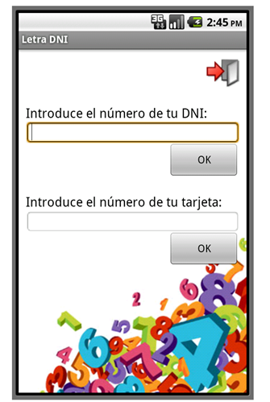

Personal data
-------------
An Android aplication to calculate the letter for a spanish DNI (National Identity Document) and to validate a credit card number.

Developed under Eclipse IDE and Android 2.2 SDK (the most stable version when the app was developed).

The application is able to perform two different operations:

* Calculate the letter of a Spansih National Identity Document (DNI).
* Calculate the validity of a credit card number.

The application has a responsive design, its views adapt automatically to the screen of the device.

